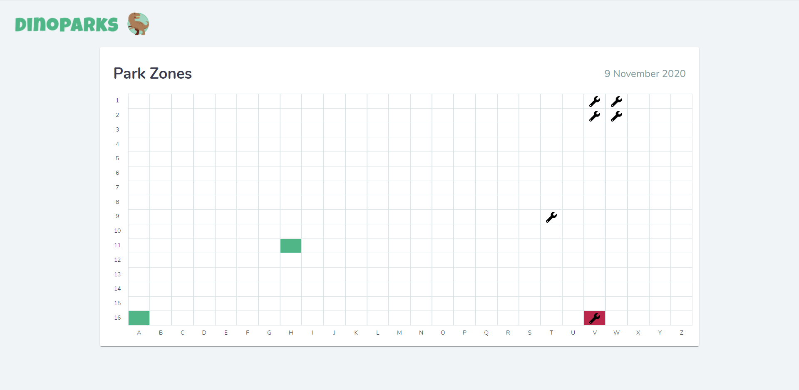
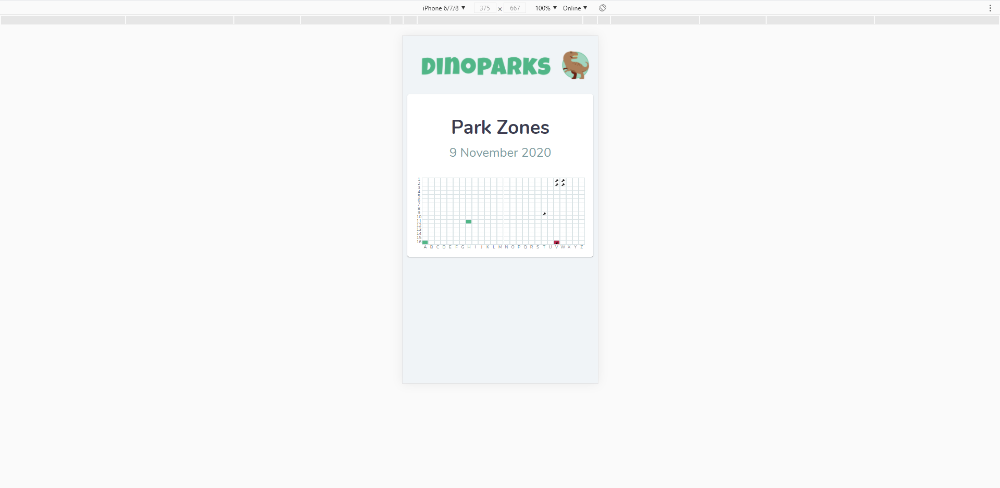
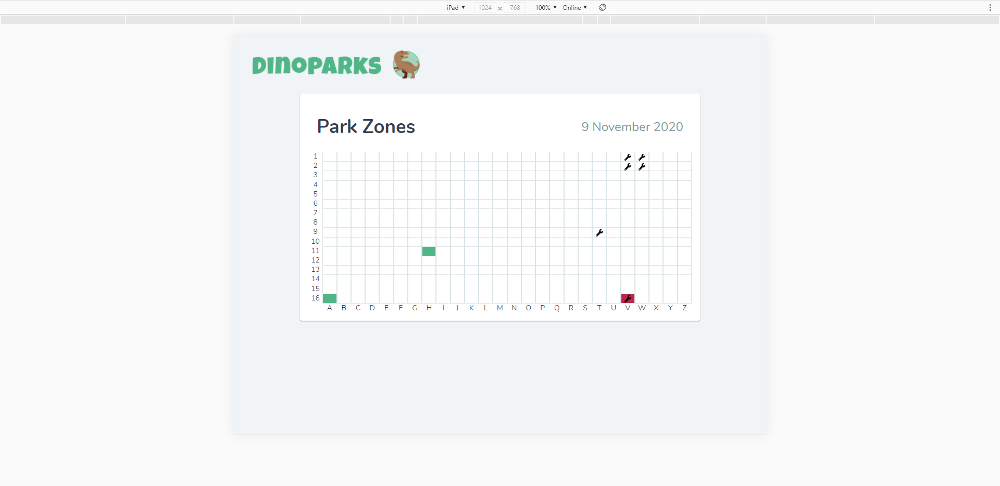
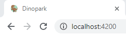
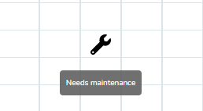
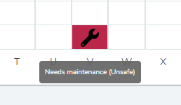
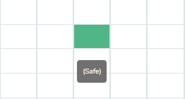

# Dinopark ~ Anqi Qu

Dinopark is an interactive and visual tool which can be used to help employees of Dinopark carry out their maintenance jobs around the dinosaur park. The UI shows the park divided into a grid of zones. Zones that need maintenance will show a wrench icon. Zones that are definitely safe to enter will be shaded in green, and zones that are unsafe to enter will be shaded in red. 

  

## How to run the dev server

Download the code and install packages. Then run `ng serve` in the terminal for a dev server. Navigate to `http://localhost:4200/`. The app will automatically reload if you change any of the source files.

  

## How I approached the problem 

After reading through the brief, I started thinking about how I would structure the app. I came up with a flow which looked something like this:
- Get data from the api
- Process the data 
- Initialise the grid 
- Style the tiles in the grid based on the api data I processed

(At first I wanted to save the data into an in-memory database, or even make a light backend. But then I had a power outage and reslised I might be a bit pressed for time if I did that, so I decided to build everything in Angular)

 I tried to include as many knowledge points as I reasonably could into this project so that I could demonstrate my skill. I decided to make a custom service for accessing the api endpoint. Then I made interfaces for Dinosaurs, DinosaurLocations, Mainenances and GridTiles. I also included a few enums where I could. 

 Next, I build a custom theme for Dinoprk using the colours provided. I chose Nunito as the font and installed some material components. 

The first logical step for me was to build the service that accessed the NUDLS api for the data. I used Angular's HttpClient and did the data processing in the service. I admit this part took me a bit longer than I expected, because it took me a while to notice that the JSON fields did not exactly match the fields I was expecting from reading the docs. Moreover, I had some trouble with the async nature of the function, but I will expand on this later.

After finishing the data-getting part, I decided to work on the grid's UI. I considered using a table, but then discovered the grid-list component and thought that was perfect. After taking care of the UI part, I moved onto the logic part which governs when blocks would show as safe/unsafe/in need of maintenance. This part was quite simple, and I think I got through it without hiccups. 

Finally I added some touchups, mainly for the UI. The web app is also responsive and will refresh dynamically if any of the blocks' statuses change

  

## What I would do differently if I had to do it again

In reality I'd use fewer Typescript enums. I'd rather have them exported from the server so that all values would be univorm across the system. I'd also focus more on the app's performance, as Lighthouse said that it could be improved. 

  

## What I learned from this project

My biggest takeaway from this project is probably the timing of async functions, such as the one used to get data from the api. The problem I ran into was that a call to get the data from the service was being made before the service had finished processing the data from the api. I tried to make the service's method async and return a promise, but that did not work since the data processing was happening inside of a .suscribe(). I then tried to bind an eventEmitter to the api's data and have to emit when the data finished processing, but I could not get a working subscription to that. Finally, I found out that I could use a Subject to return the data. Thankfully that worked, and I managed to get the data I needed. 

I also learnt a lot from using new packages and components such at MatGridList and moment

  

## How I think this challenge can be improved 

// Side note: The data returned from the api sometimes doesn't match the docs provided. In the docs, some logs had fields called "id" but those fields were actually returned as "dinosaur_id" from the api. 

### Harder

We can make the app more interactive
- Have a field to change the time and date (like a dateTime picker, so the employees can plan their maintenance on different days) 
- Show where the dinosaurs are on the grid (I know this is already kind of done, since only blocks containing dinosaurs will be shaded, but maybe there could be a dinosaur icon to explicitly show the locations of the dinosaurs or something) 
- Have an input form to add new dinosaurs 
- Click on a dinosaur to remove it or feed it
- Click on a block to maintain the block

### Even Harder
- Dinosaurs can escape.
- A dinosaur will have its speed per hour (in blocks) logged when it is moved to the park.
- When a dinosaur escapes, the program can calculate and show the possible blocks where the dinosaur might be at the time of viewing (and shade the blocks in yellow or something) 

 

## Demo Images
<caption>Desktop view</caption>

<caption>Mobile view</caption>

<caption>Tablet view</caption>

<caption>Tab & heading</caption>

<caption>Tooltip for block that needs maintenance</caption>

<caption>Tooltip for block that is unsafe</caption>

<caption>Tooltip for block that is safe</caption>

